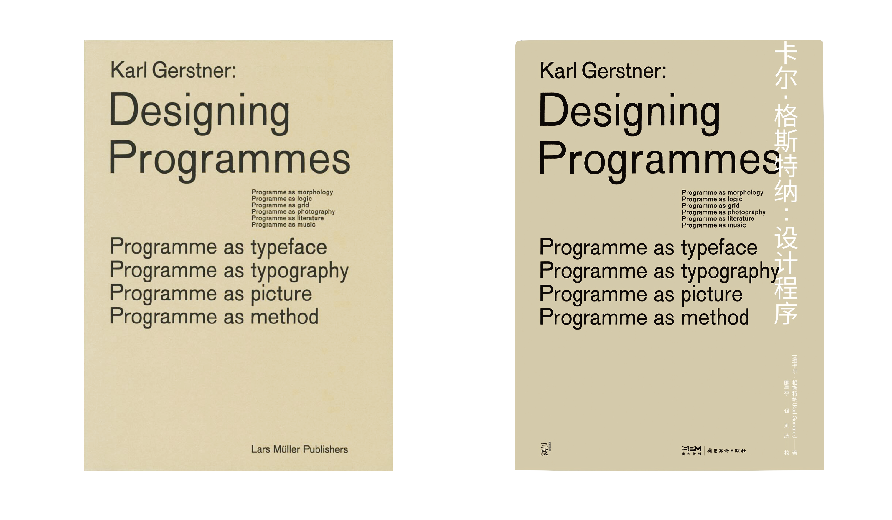
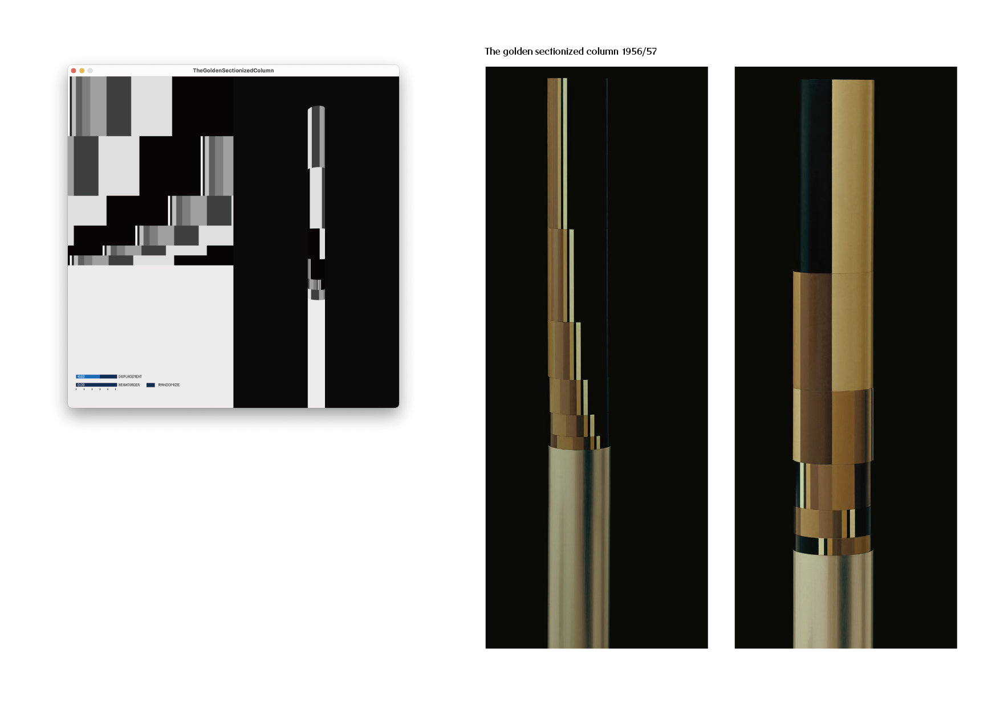
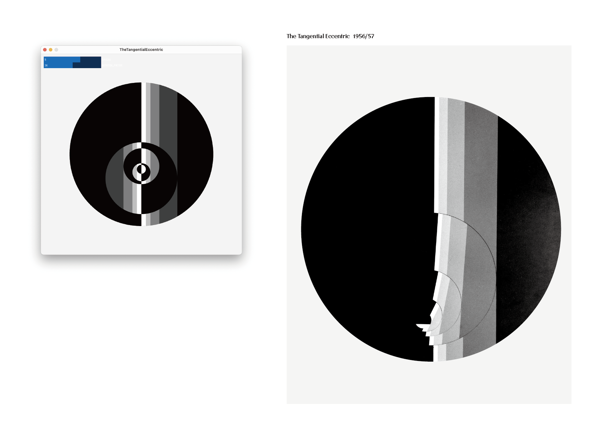

# Designing-Programmes

In 2023, the Chinese version of the renowned Swiss graphic designer [Karl Gerstner](https://en.wikipedia.org/wiki/Karl_Gerstner)'s book "[Designing Programmes](https://dl.acm.org/doi/10.5555/1564986)" was published. To help readers better understand these "manual programs" created by Gerstner in the pre-computer era, the book's translator, Professor Li Tingting, invited me to translate the programmatic artworks in the book into modern computer languages.

### Introduction

This repository is composed of representative works selected by me from the book. In an attempt to reconstruct the original appearance of the works from the underlying rule architecture, the repository will continue to be updated.

The programs are written in [Processing](https://processing.org/).

- [The Golden Sectionized Column](./TheGoldenSectionizedColumn): This program recreates Karl Gerstner's 'The Golden Sectionized Column' from 1956/57, using a sequence of height and width ratios to form a visually harmonious structure.

- [The Tangential Eccentric](./TheTangentialEccentric): This program is a modern interpretation of Gerstner's 'The Tangential Eccentric', featuring layered semicircles with adjustable rotation and size ratios to explore geometric eccentricity.

